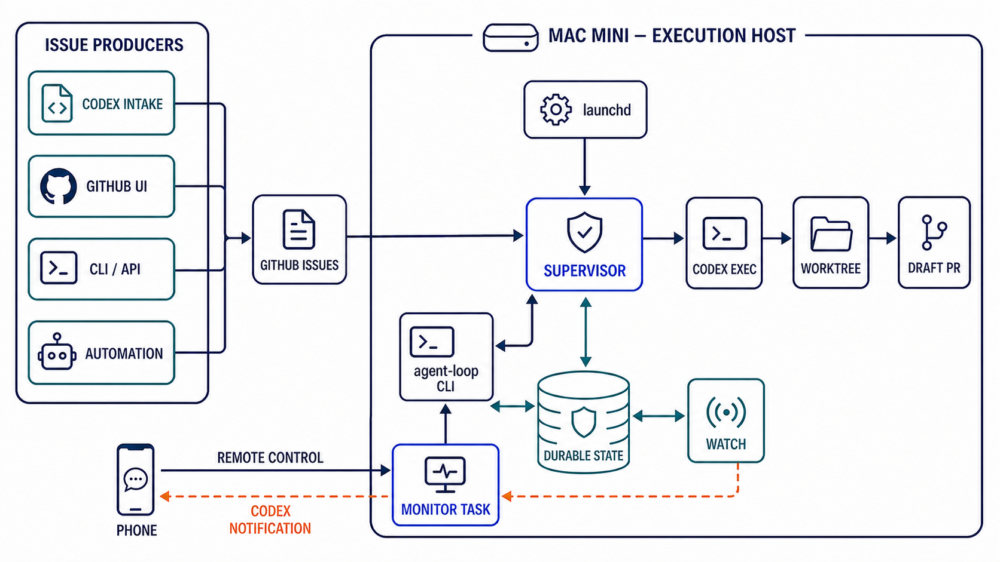

# codex-issue-loop

GitHub Issue をキューとして、着手可能な Issue が存在する限り Codex CLI のワーカーを繰り返し実行する、macOS 向けの常駐ループです。

Go製の`agent-loop` CLI、launchd supervisor、GitHub/Codex adapter、永続状態、監視・回答フローを含みます。現在は初期MVPです。本番リポジトリへ登録する前に、テスト用リポジトリで権限・ラベル・worker promptを確認してください。

## Documents

- [アーキテクチャ概要](docs/architecture.md)
- [MVP実装状況](docs/implementation.md)
- [要件定義](docs/requirements.md)
- [システム仕様](docs/specification.md)
- [脅威モデル](docs/threat-model.md)
- [セキュリティ運用runbook](docs/security-runbook.md)
- [CLI互換性マトリクス](docs/compatibility.md)
- [GitHubラベルbootstrap runbook](docs/github-labels.md)
- [doctor診断・復旧runbook](docs/doctor.md)
- [Mac mini常駐運用runbook](docs/mac-mini-runbook.md)
- [スマートフォン直接push通知](docs/notifications.md)
- [ADR-0001: macOS実行モデル](docs/adr/0001-macos-execution-model.md)
- [ADR-0002: 単一ホスト並列化と複数ホスト冗長化](docs/adr/0002-concurrency-and-multi-host.md)



## 設計の要点

- ループ本体は Codex の task や goal ではなく、独立した `agent-loop` CLI が担う
- macOS の `launchd` がループの生存を管理する
- Issue ごとに独立した `codex exec` ワーカーを起動する
- Codex Skill は起動・停止・監視・回答を CLI に橋渡しする薄い操作層とする
- GitHub Issueを投入境界とし、Issueの作成主体・作成場所・作成手段をMac mini上のCodexに限定しない
- スマートフォンでは監視用taskを主な操作入口とし、Issue作成用taskは任意のproducerの一例とする
- ユーザーへの質問が必要になった場合は状態を永続化し、監視用 task を通して回答できるようにする
- `watch` は永続状態を正本とし、イベント通知と60秒間隔のreconciliationを併用する
- Codex Goalは外側のIssueループには使わず、単一目的の長時間作業に限定して活用する
- 現行は1 host・1 workerを維持し、将来の単一host並列化と複数host冗長化は別機能として扱う

## Requirements

- Apple Silicon macOS
- Go 1.22以降（ソースからビルドする場合）
- `git`
- `gh` 2.69.0以降と対象リポジトリへの認証
- `codex` 0.136.0以降と有効なCodex認証
- ログイン中のmacOSユーザーセッション（LaunchAgentを使用）

Mac miniでは、macOSの「ディスプレイがオフのときに自動でスリープさせない」を有効にすることを推奨します。初回導入、Codex Remote接続、スマートフォン操作、障害復旧、backup、更新、撤去は[Mac mini常駐運用runbook](docs/mac-mini-runbook.md)に従ってください。

## Build and test

```sh
make ci
./bin/agent-loop --version
```

`make ci`はGitHub Actionsと同じ品質ゲートをローカルで再現し、次を順に実行します。

- `gofmt`の差分検査
- worker result schemaの同期検査
- `go mod tidy`後の`go.mod` / `go.sum`差分検査
- `go test ./...`
- `go test ./... -run '^TestFault' -count=1`
- `go test -race ./...`
- `go vet ./...`
- 到達可能なGo脆弱性の`govulncheck`
- `make build`
- release artifactの再現build検査

個別に実行する場合は、`make fmt-check schema-check tidy-check test fault-test test-race vet vuln-check build release-check`を使用してください。Pull Requestと`main`へのpushでは、Apple Siliconの`macos-15` runner上で同じ検査を実行します。障害注入ケースと仕様17.2の対応は[テストマトリクス](docs/testing.md)に記載しています。

build、test、release、`vuln-check`は、到達可能な標準library脆弱性を含まないGo 1.25.13 toolchainへ固定し、Goのtoolchain機能で初回にdownloadします。`govulncheck`はv1.6.0へ固定しています。sourceのlanguage互換下限はGo 1.22のままです。

## Setup

1. 対象リポジトリに`.agent-loop.yaml`を追加します。[設定例](.agent-loop.example.yaml)を参照してください。
2. CLIとCodex Skillをユーザー領域へインストールします。
3. 必須GitHubラベルの変更計画を確認し、作成します。
4. 対象リポジトリを登録し、診断後に開始します。

```sh
./bin/agent-loop install
~/Library/Application\ Support/codex-issue-loop/bin/agent-loop bootstrap-labels --repo /absolute/path/to/repository
~/Library/Application\ Support/codex-issue-loop/bin/agent-loop bootstrap-labels --repo /absolute/path/to/repository --apply
~/Library/Application\ Support/codex-issue-loop/bin/agent-loop register --repo /absolute/path/to/repository
~/Library/Application\ Support/codex-issue-loop/bin/agent-loop doctor --repo /absolute/path/to/repository
~/Library/Application\ Support/codex-issue-loop/bin/agent-loop start --repo /absolute/path/to/repository
```

`install`は次を配置します。

- `~/Library/Application Support/codex-issue-loop/bin/agent-loop`
- `~/.codex/skills/agent-loop/SKILL.md`
- `~/.codex/skills/agent-loop/VERSION`
- `~/Library/Application Support/codex-issue-loop/install.json`

tag付きreleaseの検証、新規install、安全なupdateとrollbackは[Release・install・update方針](docs/release.md)を参照してください。

永続schemaの更新が必要なreleaseでは、全loopを停止し、`update`で新binaryを配置してから`migrate --apply`を実行します。`migrate`は既定ではread-onlyのpreviewです。backup、途中停止からの再実行、schemaとbinaryを組で戻す手順は[永続schema migration runbook](docs/migration.md)を参照してください。

`register`はリポジトリ別の永続状態ディレクトリと`~/Library/LaunchAgents/com.codex-issue-loop.<repo-id>.plist`を作成します。認証tokenはコピーしません。

監視taskが接続していない間も`needs_input`やsupervisor blockedを知らせる必要がある場合は、opt-inのntfy adapterを利用できます。tokenは専用の`notification-token`コマンドでmode `0600`の管理fileへ保存し、設定fileやplistには置きません。provider比較、スマートフォン側の準備、機密性、到達時間の確認は[スマートフォン直接push通知](docs/notifications.md)を参照してください。

`bootstrap-labels`は既定ではpreviewだけを表示し、`--apply`を指定した場合だけ不足ラベルを作成します。既存ラベルの色・説明は一致しない場合も保持し、ラベルの更新・削除は行いません。詳細は[GitHubラベルbootstrap runbook](docs/github-labels.md)を参照してください。

`doctor`はversion文字列だけでなく、実行に必要なCLI optionとGitHub Issue操作を検査します。必須capabilityがない場合は開始を拒否します。Codexのsession resumeだけが利用できない場合は、既存worktreeと永続状態を引き継いだ新規sessionへ安全にfallbackします。対応範囲と更新確認の手順は[CLI互換性マトリクス](docs/compatibility.md)を参照してください。

`doctor --repo`は対象repositoryを、`doctor`はhostと登録済みrepository全体を診断します。JSONは`schema_version`と安定した`diagnostics[].code`を持ち、blocked/stopped状態には直近event・logと具体的な次の操作を添えます。修復は自動実行しません。[doctor診断・復旧runbook](docs/doctor.md)を参照してください。

## Operation

```sh
# 状態確認
agent-loop status --repo /path/to/repository --json

# attentionが必要になるまで1回のblocking watch
agent-loop watch --repo /path/to/repository --until-attention --json

# 質問へ回答
printf '%s\n' '選択した方針' | agent-loop answer \
  --repo /path/to/repository \
  --request-id req_... \
  --message-file - \
  --json

# opt-in通知credentialを標準入力から保存
agent-loop notification-token \
  --repo /path/to/repository \
  --token-file -

# 状態を残して停止
agent-loop stop --repo /path/to/repository

# 期限切れworktreeのread-only preview
agent-loop cleanup --repo /path/to/repository --json
```

Codex側で定期的に`status`を呼ぶ必要はありません。`watch`内部のmacOS event通知とreconciliation pollingが永続状態を確認します。

## State and safety

- 通常のworking treeは変更せず、Issueごとのworktreeを使用します。
- force push、sandbox bypass、supervisorによる状態やworktreeの自動削除は行いません。worktree整理は既定dry-runの`cleanup`と確認token必須の`purge`へ分離しています。
- `stop`、`unregister`、`uninstall`後もIssueの状態とworktreeを保持します。
- worker timeout時はprocess groupへSIGTERMを送り、`worker.timeout_grace`を超えた場合だけSIGKILLします。途中のworktreeは保持して再試行時に検査します。
- 未回答requestは回答されるまでstickyに保持されます。
- 現行のlocal `flock`は同一Mac上だけを保護します。同じrepositoryを複数hostから処理しないでください。将来設計は[ADR-0002](docs/adr/0002-concurrency-and-multi-host.md)を参照してください。
- GitHub Issue本文は信頼済みのshell入力として扱いません。
- Issue入力はサイズと制御文字を制限し、prompt内では命令ではないJSONデータとして分離します。
- state、event、worker log/result、GitHub通知では既知token形式と`security.redact_env`の値をマスクします。秘密を回答として渡さないでください。
- event、supervisor、launchd、worker logは既定16 MiBまたは24時間でgzip rotationし、7世代を保持します。terminal worker runは既定30日・100件の範囲に整理され、削除は監査eventへ記録されます。
- completed worktreeは既定7日、failedは30日、blockedとneeds-inputは無期限保持します。期限切れでもdirty、未push、open PR、未回答requestがあれば`cleanup --apply`は削除しません。[Worktree保持・cleanup・purge runbook](docs/worktree-lifecycle.md)を参照してください。
- 権限、認証、backupの本番チェックは[セキュリティ運用runbook](docs/security-runbook.md)に従ってください。
