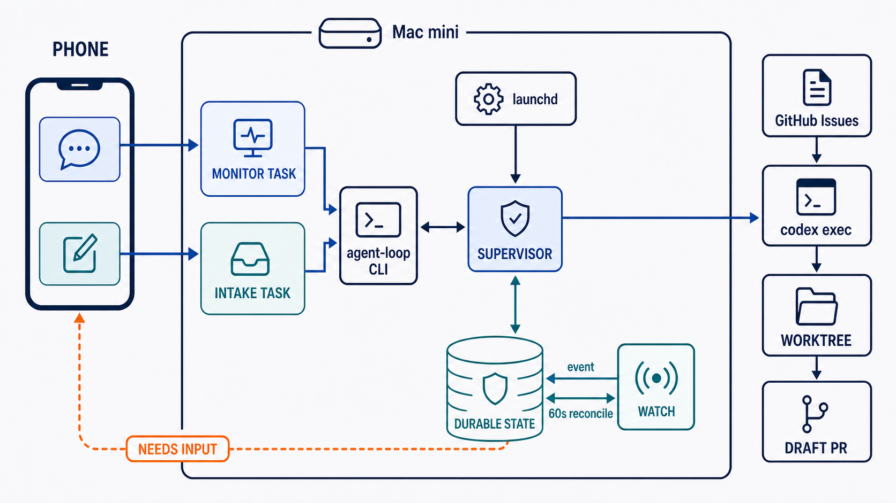

# codex-issue-loop アーキテクチャ概要

## 1. この仕組みが解決すること

`codex-issue-loop` は、常時稼働する Mac mini 上で GitHub Issue を順番に取得し、Issue が存在する限り Codex CLI のワーカーを繰り返し実行する仕組みである。

ユーザーはスマートフォンから次の2つの Codex taskを主な入口として利用する。

- **監視task**: ループの起動・停止・状態確認・質問への回答
- **Issue作成task**: 要望の整理と新しいGitHub Issueの作成

Codex taskは操作画面であり、ループの実行主体ではない。監視taskが終了しても、`launchd` 配下のsupervisorは処理を継続する。

## 2. 全体像



図中の `DURABLE STATE` がループ状態の正本である。socket等のevent通知は即時性のために使い、60秒間隔のreconciliationで通知の取りこぼしを修復する。

## 3. コンポーネントと責務

| コンポーネント | 実行主体 | 主な責務 |
| --- | --- | --- |
| 監視task | Codex app | CLI操作、状態の要約、ユーザーへの質問、回答登録 |
| Issue作成task | Codex app | 要望整理、リポジトリ調査、Issue作成 |
| agent-loop Skill | Codexが読む手順 | 自然言語を安全なCLI操作へ対応づける |
| agent-loop CLI | Goの短命プロセス | start、stop、status、watch、answer |
| launchd | macOS | supervisorの起動と異常終了時の再起動 |
| supervisor | Goの常駐プロセス | Issue選択、claim、worker起動、状態遷移、復旧 |
| Codex worker | `codex exec` | 1件のIssueの調査、worktree内の実装・検証、構造化結果の返却 |
| publisher | supervisor内の決定論的処理 | 差分検査、commit、push、draft PR作成・既存PR再利用 |
| GitHub | 外部共有状態 | Issueキュー、ラベル、コメント、Pull Request |
| 永続状態 | ローカルファイル | snapshot、event log、未回答request、世代番号 |

責務の中心は次のように分かれる。

```text
Codex app     = 人との対話
agent-loop    = 決定論的な制御と継続実行
Codex worker  = 1 Issue内の非決定的な開発作業
GitHub        = 人とループが共有する仕事のキュー
```

## 4. 通常の実行フロー

1. supervisorがGitHubから着手可能なIssueを取得する。
2. 決定論的な順序で1件を選び、ラベルとローカル状態でclaimする。
3. Issue専用のbranchとworktreeを用意する。
4. `codex exec`ワーカーがpreflightを行い、そのまま実装を開始する。
5. ワーカーはworktree内で実装とテストを行い、構造化結果を返す。Git metadata、remote、GitHubは変更しない。
6. supervisorのpublisherが差分を検査し、署名なしで非対話commit、push、draft PR作成を冪等に行う。
7. supervisorが公開結果を永続化し、GitHubへ反映する。
8. 次のIssueを選ぶ。キューが空なら低負荷で待機する。

IssueごとのCodex workerは外側のループを所有しない。次のIssueを選ぶのは常にsupervisorである。

## 5. preflightと実行プロファイル

preflightは別のユーザー確認工程ではなく、各Issueの最初に必ず行う論理フェーズである。初回のCodex workerは次を確認したうえで、そのまま作業を開始する。

- 受け入れ条件と変更範囲
- 依存関係と検証方法
- 破壊的操作、権限追加、外部公開、課金の有無
- 複数段階の調査や反復が必要か
- 1回のworker実行で完了できる見込み

preflightは実行方針を次のどちらかに分類する。

| profile | 用途 | supervisorの扱い |
| --- | --- | --- |
| `standard` | 範囲が明確で、1回のworker実行で完了が見込める | 通常の上限とtimeoutで実行 |
| `extended` | 調査、移行、広範な変更、複数回の検証が必要 | continuation budgetを確保し、必要なら`codex exec resume`で継続 |

分類が難しい場合にユーザーへ質問してはならない。可逆性と安全性を維持できる限り、より強い `extended` を選ぶ。

preflightは必ずしも2つのCodex workerを起動することを意味しない。初回workerの中でpreflightから実装へ連続して進み、追加実行が必要な場合だけsupervisorが継続workerを起動する。

## 6. Codex Goalの位置づけ

Codex Goalは、一つの具体的な目的と検証可能な完了条件を追う長時間作業に適している。一方、GitHub Issueを選び続ける無期限のキュー処理とは責務が異なる。

このため、次の境界を設ける。

- Goalを外側のIssueループ、プロセス監視、永続状態の正本にはしない。
- 現行のheadless workerは `standard` / `extended` profileで制御する。
- `extended` の継続はsupervisorが `codex exec resume` を管理する。
- 監視taskで「この障害を復旧する」など単一目的を追う場合は、ユーザーがGoalを利用してよい。
- 将来、公式のheadless Goal APIが提供された場合は、`extended` profileのoptional adapterとして評価する。

したがってGoalは排除せず、適用範囲を単一目的の内側に限定する。

## 7. 質問で止まる場合

ワーカーは次の場合に限って `needs_input` を返す。

- 外部仕様やUI動作を変えるプロダクト判断
- データ削除、公開、課金、credential、権限拡大
- リポジトリ内の情報だけでは安全に決められない事項
- 相反する受け入れ条件

命名、局所的な実装、既存規約から推測できる事項、容易に戻せる内部構造については質問せず進める。また、`standard` / `extended` の分類をユーザーへ質問しない。

`needs_input` は一過性の通知ではない。request IDと質問内容を永続状態へ保存し、ユーザーが回答するまでattention状態を保持する。監視taskが切断されても質問は失われない。

## 8. 監視を取りこぼさない仕組み

### 8.1 基本方針

監視では次の優先順位を守る。

1. **永続状態が正本**
2. **event通知は低遅延化のヒント**
3. **低頻度pollingは取りこぼし修復**

socket、ファイル通知、プロセス内channel等のeventだけに依存しない。eventを受信した場合も、そのpayloadを正本とはせず永続状態を読み直す。

### 8.2 watchアルゴリズム

`agent-loop watch --until-attention` は次の順序で動作する。

1. snapshotを読み、既にattention状態なら直ちに返す。
2. event通知を購読する。
3. 購読開始とのraceを防ぐためsnapshotをもう一度読む。
4. eventまたはreconciliation期限までOSレベルで待機する。
5. 起床後にsnapshotを読み直す。
6. `needs_input`、`blocked`、`stopped`等なら構造化結果を返す。
7. 通常状態なら再び待機する。

snapshotには単調増加する `state_revision` を持たせる。watchは最後に確認したrevisionを記録し、再接続後も状態変化を比較できる。

reconciliation間隔の既定値は60秒とし、複数watchがある場合はjitterを加える。これはIssueキューを取得する `queue.poll_interval` とは別の設定である。

### 8.3 トークン消費の境界

reconciliation pollingはGoプロセス内で行い、待機中のheartbeatや途中結果をCodexへ返さない。この待機処理はモデルを呼び出さないため、polling自体はLLMトークンを消費しない。

Codexに「一定時間ごとにstatusを確認する」と推論させる設計は禁止する。Codexはwatchがattention結果を返した後の要約、ユーザーへの質問、回答登録にだけ使う。

ただし、Codex task内で保留中のtool callについて、OpenAIが課金を含む厳密なゼロトークン保証を公開しているとは限らない。そのため「Go側の待機ではモデル呼び出しを行わない」という実装上の保証と、Codex製品全体の課金仕様を区別する。

## 9. 障害時の振る舞い

| 障害 | 継続するもの | 復旧方法 |
| --- | --- | --- |
| 監視taskが終了 | supervisor、Issue処理、永続質問 | 同じまたは新しい監視taskからstatus/watch |
| event通知を取りこぼす | 永続状態、attention状態 | 60秒以内のreconciliation |
| watchプロセスが終了 | supervisor、永続状態 | 監視taskからwatchへ再接続 |
| Codex workerが異常終了 | worktree、run状態 | backoff後に再試行またはextended continuation |
| supervisorが異常終了 | snapshot、event log、GitHub状態 | launchd再起動後にreconciliation |
| Macがスリープ | 実行は停止し得る | macOSの「ディスプレイoff時もスリープさせない」を有効化 |

外部supervisorからCodex taskを直接wakeする公開APIには依存しない。監視taskが接続されていない期間の即時pushが必要になった場合は、スマートフォンへの直接通知adapterを別機能として追加する。

## 10. 設計上の不変条件

- ループの正本状態をCodex taskの会話履歴だけに置かない。
- 未回答requestは回答または明示取消まで消さない。
- eventを状態そのものとして扱わない。
- Codexによる定期pollingを行わない。
- 1 Issueにつき同時に1つのwriterだけを許可する。
- workerに次Issueの選択や無限ループを任せない。
- preflightの実行経路選択でユーザーを止めない。
- Goalを永続supervisorの代替にしない。

## 11. 日常運用のイメージ

通常、ユーザーが触るのは次の2つだけである。

1. `[INTAKE] <repo> — new issue` で新しい仕事を登録する。
2. `[LOOP] <repo> — monitor` で状態確認と必要な回答を行う。

ループに着手可能なIssueがあればsupervisorが自動的に処理する。質問が必要になれば監視taskのwatchが戻り、Codexがユーザーへ質問する。回答後は同じworktreeと保存済みコンテキストを使って処理を再開する。
